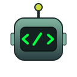
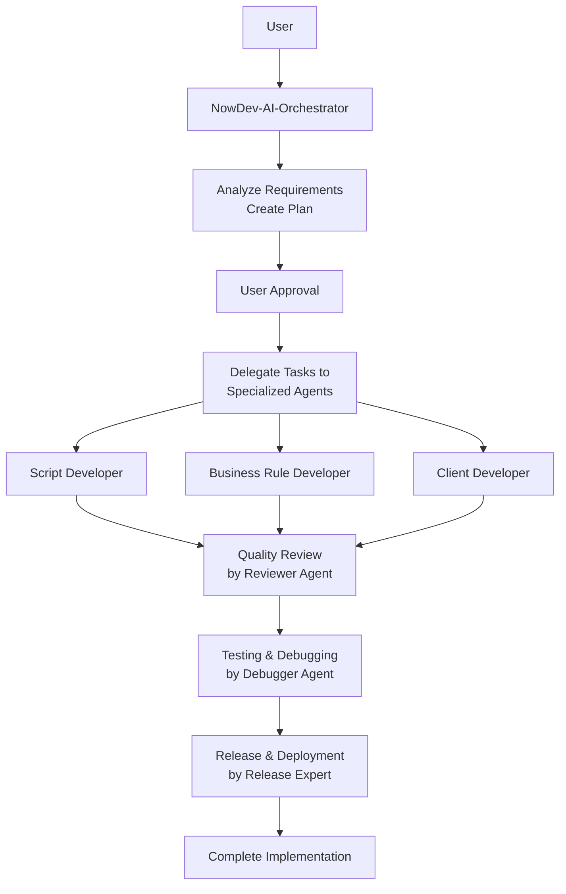

# NowDev AI Toolbox

<div align="center">
  
  <br><br>
  
  
  
  
  
  <br>
  
  
</div>

## Overview

NowDev AI Toolbox is a Visual Studio Code extension that provides specialized AI agents for ServiceNow development within GitHub Copilot Chat. These agents are designed specifically for ServiceNow best practices and development workflows, offering targeted assistance for different aspects of ServiceNow development.

## Installation & Usage

### Prerequisites
- Visual Studio Code 1.93 or later
- GitHub Copilot Chat extension
- **[Context7 MCP Server](https://github.com/upstash/context7)** - Required for agents to access ServiceNow documentation and best practices

  **Setup Instructions:**
  1. Visit the [Context7 GitHub repository](https://github.com/upstash/context7)
  2. Follow the installation instructions for your platform
  3. Configure Context7 to provide access to ServiceNow documentation
  4. Ensure Context7 is running before using the NowDev AI agents

  *Context7 enables the AI agents to reference official ServiceNow documentation and verified best practices during development.*

### Quick Start

1. **Download the VSIX** from the [Releases](https://github.com/DanielMadsenDK/NowDev-AI-Toolbox/releases) section
2. **Install the extension** in VS Code: `Extensions → Install from VSIX...`
3. **Open GitHub Copilot Chat** in VS Code
4. **Select "NowDev-AI-Orchestrator"** from the dropdown menu
5. **Start chatting** to plan and coordinate your ServiceNow development tasks

All agents are automatically available in every workspace once the extension is installed.

### Recommended Workflow

**Always start with the NowDev-AI-Orchestrator** for any new task or feature. The orchestrator will:
- Analyze your requirements and create a detailed implementation plan
- Break down complex tasks into manageable steps
- Coordinate between specialized agents as needed
- Ensure all work follows ServiceNow best practices

You can also use specialized agents directly for specific tasks, but starting with the orchestrator ensures proper planning and coordination.

#### Development Workflow Diagram



### Example Usage
Open GitHub Copilot Chat, select "NowDev-AI-Orchestrator" from the agent dropdown, and type:
```
I need to create a custom ServiceNow application for managing IT assets with approval workflows
```

## Specialized Agents

The extension provides 7 specialized AI agents, each focused on different aspects of ServiceNow development:

| Agent | Description | Use Case |
|-------|-------------|----------|
| NowDev-AI-Orchestrator | Solution Architecture & Workflow Management | Planning complex ServiceNow implementations |
| NowDev-AI-Script-Developer | Server-side libraries & GlideAjax | Creating Script Includes and server-side logic |
| NowDev-AI-BusinessRule-Developer | Database triggers & automation logic | Implementing Business Rules and workflows |
| NowDev-AI-Client-Developer | Browser-side UI & interaction | Client Scripts and UI customizations |
| NowDev-AI-Reviewer | Code Review, Security & Compliance | Quality assurance and best practices validation |
| NowDev-AI-Debugger | Diagnostics, Logs & Performance Analysis | Troubleshooting and performance optimization |
| NowDev-AI-Release-Expert | Update Sets, XML Data & Deployment | Release management and deployment |

## Architecture

The extension integrates specialized AI agents directly into VS Code through GitHub Copilot Chat's agent system. Each agent is a declarative Copilot Agent with defined capabilities and expertise areas.

### Agent Capabilities
- **Specialized Knowledge**: Each agent contains deep expertise in specific ServiceNow domains
- **Best Practices**: Agents follow ServiceNow development best practices and guidelines
- **Inter-Agent Communication**: Agents can hand off tasks and collaborate on complex projects
- **Context Awareness**: Agents understand your workspace and can reference existing code

### Core Logic Framework
The agents are built on a comprehensive framework of ServiceNow best practices covering:
- Business Rules development
- Client-side scripting
- Server-side scripting
- Debugging and performance optimization
- Release management and deployment

## Documentation & Resources

### Core Logic Framework
The extension includes comprehensive documentation on ServiceNow best practices:
- [Business Rules Best Practices](core-logic/BusinessRulesBestPractices.md)
- [Client Script Best Practices](core-logic/ClientScriptBestPractices.md)
- [Script Include Best Practices](core-logic/ScriptBestPractices.md)
- [Debugging Best Practices](core-logic/DebuggingBestPractices.md)
- [Update Set Best Practices](core-logic/UpdateSetBestPractices.md)
- [XML Data Best Practices](core-logic/XmlBestPractices.md)
- [Log Analysis Best Practices](core-logic/LogsBestPractices.md)

### Agent Definitions
Each AI agent is defined in declarative format:
- [View Agent Definitions](agents/github-copilot/)

## Contributing

This project welcomes contributions! Please see our [Contributing Guide](CONTRIBUTING.md) for details.

## License

This project is licensed under the MIT License - see the [LICENSE](LICENSE) file for details.

## Author

**Daniel Aagren Seehartrai Madsen** - ServiceNow Rising Star 2025

*Dedicated to elevating the standard of ServiceNow development through AI innovation.*
