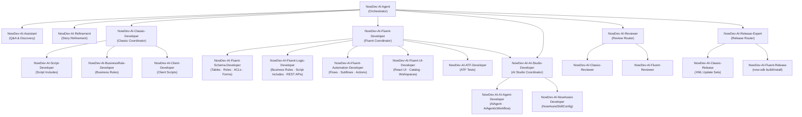

# NowDev AI Toolbox
<div align="center">

</div>

<div align="center">

  
  
  
  
  <br>
  
  
</div>

## Overview

NowDev AI Toolbox is a Visual Studio Code extension that provides specialized AI agents for ServiceNow development within GitHub Copilot Chat. Acting as a Lead Architect, the system orchestrates specialized sub-agents to plan, build, review, and deploy full-stack solutions.

The extension integrates ServiceNow Best Practice Skills directly into GitHub Copilot, ensuring generated code adheres to strict performance and security standards. It features an AI Orchestrator that breaks down requirements, visualizes architecture with Mermaid diagrams, and delegates tasks to specialized agents for scripting, business logic, and deployment.

### Key Features

*   **AI Orchestrator**: A master agent that breaks down requirements and delegates tasks to specialized sub-agents.
*   **Built-in Agent Skills**: Automatically equips GitHub Copilot with verified knowledge of ServiceNow best practices.
*   **Automated Governance**: Specialized reviewer agents inspect each artifact, dynamically selecting only the best-practice checks relevant to the artifact types actually present in the solution.
*   **Multi-Tier Agent Architecture**: The orchestrator delegates to development agents, which hand off to specialized reviewer agents — agents calling agents — enabling deep, context-aware automation at every layer of the development workflow.
*   **Interactive Workflow**: Uses interactive tools to clarify requirements and validate designs.
*   **Live Instance Preview & Autonomous Verification**: Agents autonomously inspect your ServiceNow instance in real-time—capturing screenshots, reading form field state, validating form behavior, and detecting client-side issues without manual inspection. Perfect for post-deployment verification and debugging client-side problems.

## Installation & Usage

### Prerequisites
- Visual Studio Code 1.113 or later
- GitHub Copilot Chat extension
- **Enable nested sub-agents** — add `"chat.subagents.allowInvocationsFromSubagents": true` to your VS Code `settings.json`. Without this setting, the multi-level agent hierarchy will not function (coordinators cannot invoke their specialists).

The Context7 MCP Server must be installed manually in VS Code to enable the AI agents to reference official ServiceNow documentation and verified best practices during development.

[](https://insiders.vscode.dev/redirect?url=vscode:mcp/by-name/io.github.upstash/context7)

Click the button above to install the Context7 MCP server plugin in VS Code.

#### Manual Context7 Setup (If Plugin Installation is Blocked)

If you cannot install the Context7 MCP plugin due to group policy restrictions or other installation issues, you can manually configure the remote Context7 server:

1. Open your VS Code MCP config file:
   - **Windows**: `%APPDATA%\Code\User\mcp.json`
   - **macOS**: `~/Library/Application Support/Code/User/mcp.json`
   - **Linux**: `~/.config/Code/User/mcp.json`

2. Add the following configuration to the `servers` section:
```json
"io.github.upstash/context7": {
  "type": "http",
  "url": "https://mcp.context7.com/mcp"
}
```

3. Your `mcp.json` should look like this:
```json
{
  "servers": {
    "io.github.upstash/context7": {
      "type": "http",
      "url": "https://mcp.context7.com/mcp"
    }
  }
}
```

4. Restart VS Code for the changes to take effect.

**Note**: If Context7 is unavailable, the agents will automatically fall back to using built-in skills for development guidance and best practices.

### Quick Start

1. **Download the VSIX** from the [Releases](https://github.com/DanielMadsenDK/NowDev-AI-Toolbox/releases) section
2. **Install the extension** in VS Code: `Extensions → Install from VSIX...`
3. **Open GitHub Copilot Chat** in VS Code
4. **Select "NowDev AI Agent"** from the dropdown menu
5. **Start chatting** to plan and coordinate your ServiceNow development tasks

All agents are automatically available in every workspace once the extension is installed.

### Recommended Workflow

**Always start with the NowDev-AI-Orchestrator** for any new task or feature. The orchestrator will:
- Analyze your requirements and create a detailed implementation plan
- Break down complex tasks into manageable steps
- Coordinate between specialized agents as needed
- Ensure all work follows ServiceNow best practices

You can also use specialized agents directly for specific tasks, but starting with the orchestrator ensures proper planning and coordination.

### Example Usage
Open GitHub Copilot Chat, select "NowDev AI Agent" from the agent dropdown, and type:
```
I need to create a custom ServiceNow application for managing IT assets with approval workflows
```

## Customizing Agent Behavior

The `nowdev-ai-toolbox.customInstructionsFile` setting lets you supply a Markdown or plain-text file whose contents are injected into **every** agent session as the highest-priority directives — overriding built-in defaults where they conflict.

This is the primary mechanism for enforcing org-specific standards:
- Coding conventions and framework preferences (e.g. "always use Fluent SDK")
- Naming rules (scope prefix, casing, identifier patterns)
- Forbidden patterns (e.g. `eval()`, N+1 queries, hard-coded `sys_id` values)
- Unconditional "always use / never use" directives

### How to Configure

1. Copy [`agents/github-copilot/CUSTOM-INSTRUCTIONS-TEMPLATE.md`](agents/github-copilot/CUSTOM-INSTRUCTIONS-TEMPLATE.md) to a path of your choice (e.g. `~/nowdev-custom-instructions.md`).
2. Edit the file to reflect your team's standards.
3. Point the extension at your file using **one** of these methods:

   **Option A — Sidebar (recommended):** Click the NowDev AI Toolbox icon in the VS Code Activity Bar to open the sidebar panel. In the *Custom Instructions File* row, click the **Browse…** button and select your file using the OS file picker. The path is saved automatically to your global VS Code settings.

   **Option B — VS Code Settings:** Open Settings (`Ctrl+,`), search for `NowDev AI Toolbox`, and paste the absolute path into the **Custom Instructions File** field.

The extension reads the file on every save and writes its content into `.vscode/nowdev-ai-config.json` under the `customInstructions` key. All agents then receive these instructions automatically.

> **Note**: `.vscode/nowdev-ai-config.json` is auto-generated and is automatically added to `.gitignore`. It should not be committed to source control.

### Template Sections

The [template](agents/github-copilot/CUSTOM-INSTRUCTIONS-TEMPLATE.md) covers these sections (all optional):

| Section | Purpose |
|---------|---------|
| `## Development Preferences` | Default framework, SDK version, coding style |
| `## Naming Conventions` | Scope prefix, table names, casing rules |
| `## Scope and Application` | Restrict changes to specific scopes/apps |
| `## Excluded Patterns` | Hard-forbidden APIs and practices |
| `## Always Use / Never Use` | Unconditional short-form directives |

## Specialized Agents

The extension provides a hierarchical system of AI agents spanning three tiers. **Tier 1** agents are invoked directly by the orchestrator. **Tier 2** agents are coordinators and routers that delegate to **Tier 3** specialists. All tiers are wired automatically — you only ever interact with the Tier 1 agents.

### Tier 1 — Orchestrator

| Agent | Description |
|-------|-------------|
| NowDev-AI-Orchestrator | Lead Architect — triages requests, plans solutions, and coordinates all other agents |

### Tier 2 — Domain Coordinators & Routers

| Agent | Description | Routes To |
|-------|-------------|-----------|
| NowDev-AI-Assistant | Lightweight Q&A, brainstorming, and early discovery | — |
| NowDev-AI-Refinement | User story refinement and feasibility validation before development | — |
| NowDev-AI-Classic-Developer | Classic scripting coordinator — analyzes requirements and delegates to Classic sub-agents | Script, BusinessRule, Client developers |
| NowDev-AI-Fluent-Developer | Fluent SDK coordinator — analyzes requirements and delegates to Fluent specialists | Schema, Logic, Automation, UI, AI Studio developers |
| NowDev-AI-AI-Studio-Developer | AI Studio coordinator (SDK 4.5.0+) — routes based on whether request needs an AiAgent/AiAgenticWorkflow or a NowAssist Skill | AI Agent Developer, NowAssist Developer |
| NowDev-AI-Reviewer | Review router — detects Classic vs Fluent and delegates to the right reviewer | Classic Reviewer, Fluent Reviewer |
| NowDev-AI-Release-Expert | Release router — detects Classic vs Fluent and delegates to the right release agent | Classic Release, Fluent Release |

### Tier 3 — Specialists (internal, invoked by coordinators only)

| Agent | Coordinator | Description |
|-------|-------------|-------------|
| NowDev-AI-Script-Developer | Classic-Developer | Server-side Script Includes and GlideAjax |
| NowDev-AI-BusinessRule-Developer | Classic-Developer | Business Rules and database triggers |
| NowDev-AI-Client-Developer | Classic-Developer | Client Scripts, UI Policies, and UI Actions |
| NowDev-AI-Fluent-Schema-Developer | Fluent-Developer | Tables, Roles, ACLs, Properties, Menus, Cross-Scope Privileges, Form Layouts, Instance Scan Checks |
| NowDev-AI-Fluent-Logic-Developer | Fluent-Developer | Business Rules, Script Includes, Script Actions, REST APIs, Email Notifications, SLAs, Scheduled Scripts |
| NowDev-AI-Fluent-Automation-Developer | Fluent-Developer | Flows, Subflows, custom Action Definitions, custom Trigger Definitions |
| NowDev-AI-Fluent-UI-Developer | Fluent-Developer | React UI Pages, Client Scripts, UI Policies, Service Catalog, Service Portal, Workspaces, Dashboards |
| NowDev-AI-ATF-Developer | Fluent-Developer | ATF Test() definitions covering form, REST, server-side, catalog, and navigation test steps |
| NowDev-AI-AI-Agent-Developer | AI-Studio-Developer | AiAgent definitions with tools, triggers, version management, and AiAgenticWorkflow team orchestration |
| NowDev-AI-NowAssist-Developer | AI-Studio-Developer | NowAssistSkillConfig — tool graph, LLM prompts, security controls, and deployment settings |
| NowDev-AI-Classic-Reviewer | Reviewer | Reviews Classic scripts against best practices |
| NowDev-AI-Fluent-Reviewer | Reviewer | Reviews Fluent SDK artifacts against best practices |
| NowDev-AI-Classic-Release | Release-Expert | Generates XML Update Set files for Classic deployment |
| NowDev-AI-Fluent-Release | Release-Expert | Runs `now-sdk build` and `now-sdk install` for Fluent deployment |

## Architecture

The extension integrates specialized AI agents directly into VS Code through GitHub Copilot Chat's agent system. Each agent is a declarative Copilot Agent with defined capabilities and expertise areas.

### Agent Architecture Diagram


```mermaid
graph TD
    ORC["NowDev AI Agent\n(Orchestrator)"]

    ORC --> ASS["NowDev-AI-Assistant\n(Q&A & Discovery)"]
    ORC --> REF["NowDev-AI-Refinement\n(Story Refinement)"]
    ORC --> CLA["NowDev-AI-Classic-Developer\n(Classic Coordinator)"]
    ORC --> FLU["NowDev-AI-Fluent-Developer\n(Fluent Coordinator)"]
    ORC --> AIS["NowDev-AI-AI-Studio-Developer\n(AI Studio Coordinator)"]
    ORC --> REV["NowDev-AI-Reviewer\n(Review Router)"]
    ORC --> REL["NowDev-AI-Release-Expert\n(Release Router)"]

    CLA --> SCR["NowDev-AI-Script-Developer\n(Script Includes)"]
    CLA --> BRD["NowDev-AI-BusinessRule-Developer\n(Business Rules)"]
    CLA --> CLI["NowDev-AI-Client-Developer\n(Client Scripts)"]

    FLU --> SCH["NowDev-AI-Fluent-Schema-Developer\n(Tables · Roles · ACLs · Forms)"]
    FLU --> LOG["NowDev-AI-Fluent-Logic-Developer\n(Business Rules · Script Includes · REST APIs)"]
    FLU --> AUT["NowDev-AI-Fluent-Automation-Developer\n(Flows · Subflows · Actions)"]
    FLU --> UI["NowDev-AI-Fluent-UI-Developer\n(React UI · Catalog · Workspaces)"]
    FLU --> ATF["NowDev-AI-ATF-Developer\n(ATF Tests)"]
    FLU --> AIS

    AIS --> AAD["NowDev-AI-AI-Agent-Developer\n(AiAgent · AiAgenticWorkflow)"]
    AIS --> NAD["NowDev-AI-NowAssist-Developer\n(NowAssistSkillConfig)"]

    REV --> CR["NowDev-AI-Classic-Reviewer"]
    REV --> FR["NowDev-AI-Fluent-Reviewer"]

    REL --> CRR["NowDev-AI-Classic-Release\n(XML Update Sets)"]
    REL --> FRR["NowDev-AI-Fluent-Release\n(now-sdk build/install)"]
```

### Agent Capabilities
- **Specialized Knowledge**: Deep expertise in specialized ServiceNow domains.
- **Native Skills**: "Mounts" verified Best Practice documentation directly into the agent's context window.
- **Orchestration**: Seamlessly hands off tasks between Planning, Development, Review, and Release agents.
- **Three-Tier Agent Hierarchy**: The orchestrator delegates to domain coordinators (Classic Developer, Fluent Developer, Reviewer, Release Expert), which in turn delegate to focused specialists (Script Developer, Business Rule Developer, Classic Reviewer, Fluent Release, etc.). Each tier handles only its own concerns — you never need to pick the right specialist manually.

## Code Examples

The project includes comprehensive code examples from the official [ServiceNow SDK Examples Repository](https://github.com/servicenow/sdk-examples) integrated directly into the skills. Each skill in the `agents/skills/` directory includes an `EXAMPLES.md` file with code examples:

- **[servicenow-fluent-development/references/EXAMPLES.md](agents/skills/servicenow-fluent-development/references/EXAMPLES.md)** — Tables, business rules, REST APIs, ACLs, UI actions, service catalog
- **[servicenow-business-rules/references/EXAMPLES.md](agents/skills/servicenow-business-rules/references/EXAMPLES.md)** — Before/after/async rules, validation, recursion prevention
- **[servicenow-http-integrations/references/EXAMPLES.md](agents/skills/servicenow-http-integrations/references/EXAMPLES.md)** — REST APIs, OAuth, error handling, SOAP
- **[servicenow-client-scripts/references/EXAMPLES.md](agents/skills/servicenow-client-scripts/references/EXAMPLES.md)** — Form initialization, GlideAjax, validation
- **[servicenow-script-server-logic/references/EXAMPLES.md](agents/skills/servicenow-script-server-logic/references/EXAMPLES.md)** — Script includes, utilities, database queries
- **[servicenow-flow-designer/references/EXAMPLES.md](agents/skills/servicenow-flow-designer/references/EXAMPLES.md)** — Workflow automation, escalation, approval workflows
- **[servicenow-ui-forms/references/EXAMPLES.md](agents/skills/servicenow-ui-forms/references/EXAMPLES.md)** — Form field manipulation, UI actions, dynamic behavior

## Included Skills

These best practice modules are now natively registered as Copilot Skills:
- **ServiceNow Scripting**: Naming conventions, `GlideAggregate` vs `GlideRecord`, and forbidden patterns (`eval`).
- **Business Rules**: Execution timing (`before`/`after`/`async`), recursion prevention, and IIFE wrapping.
- **Client Scripts**: `GlideAjax` patterns, performance optimization, and `g_scratchpad` usage.
- **Deployment**: Update Set hygiene, batching strategies, and XML migration rules.

### Agent Definitions
Each AI agent is defined in declarative format:
- [View Agent Definitions](agents/github-copilot/)

## Included Examples & Attribution

This project integrates code examples from the [ServiceNow SDK Examples Repository](https://github.com/servicenow/sdk-examples) (MIT License) directly into the agent skills. Each skill's `EXAMPLES.md` file contains working code examples demonstrating best practices.

For details on third-party licenses and attribution, see [THIRD_PARTY.md](THIRD_PARTY.md).

## License

This project is licensed under the GNU General Public License v3.0 - see the [LICENSE](LICENSE) file for details.

Code examples adapted from the ServiceNow SDK Examples Repository are licensed under the MIT License - see [LICENSES/MIT-ServiceNow-SDK.txt](LICENSES/MIT-ServiceNow-SDK.txt) for details.

## Author

**Daniel Aagren Seehartrai Madsen** - ServiceNow Rising Star 2025

*Dedicated to elevating the standard of ServiceNow development through AI innovation.*
